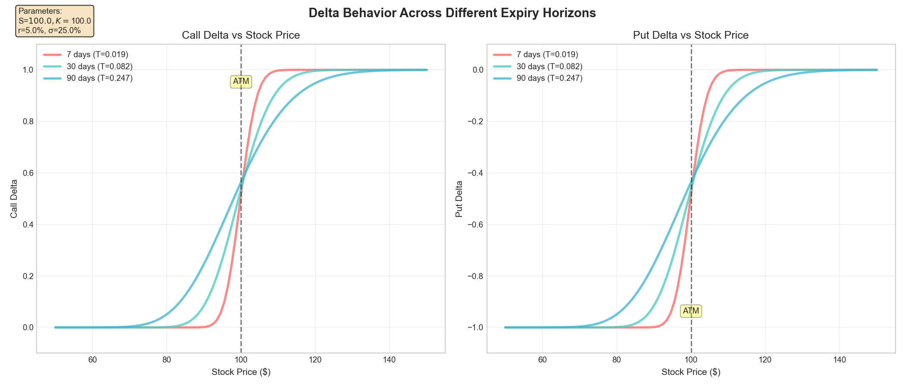
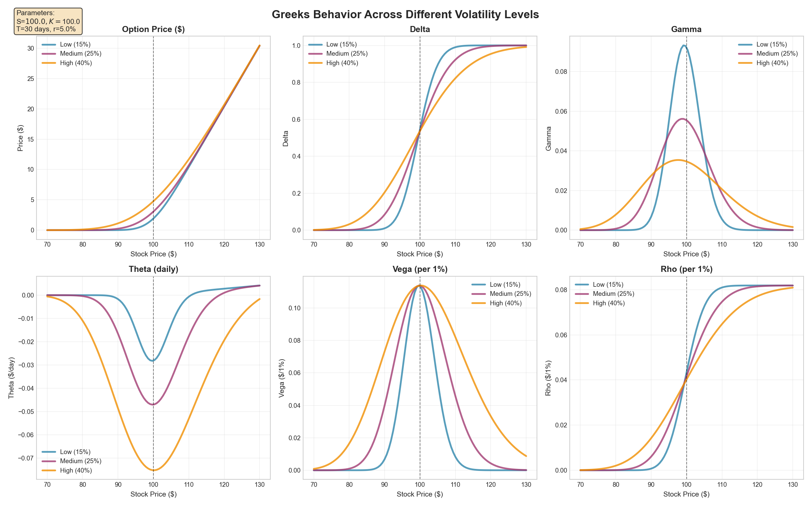
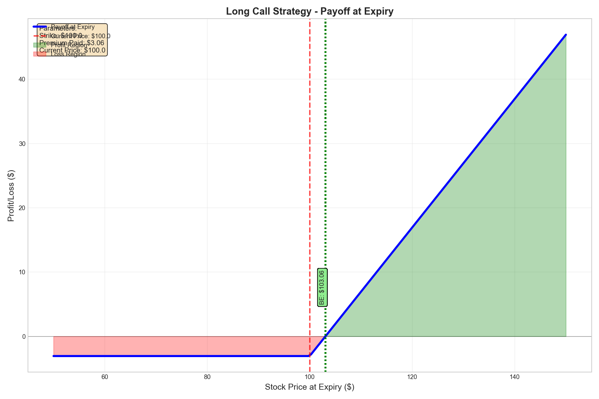
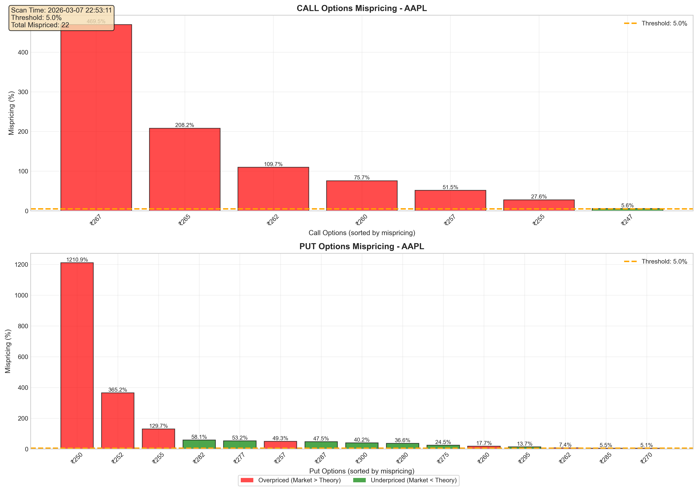

# Options Pricing & Greeks Simulator 

 Portfolio project that demonstrates advanced Python programming, financial mathematics, and data visualization skills. Below is a complete walkthrough of what this project does and how it works.

## 🎯 **Project Overview**

I built this options pricing and analysis toolkit from scratch to show my understanding of:
- **Financial Mathematics**: Complete Black-Scholes implementation
- **Advanced Programming**: Numerical methods, data visualization, real-time data integration
- **Problem Solving**: Edge case handling, input validation, real-world limitations

---

## 📋 **Table of Contents**
1. [🧮 Interactive Black-Scholes Calculator](#-interactive-black-scholes-calculator)
2. [📊 Advanced Visualization Suite](#-advanced-visualization-suite)
3. [🔍 Live Market Data Scanner](#-live-market-data-scanner)
4. [🧮 Mathematical Foundation](#-mathematical-foundation)
5. [💻 Technical Implementation](#-technical-implementation)

---

## 🧮 **Interactive Black-Scholes Calculator**

### **What It Does**
The calculator lets users input option parameters and instantly see:
- Call and put option prices
- All five Greeks (Delta, Gamma, Theta, Vega, Rho)
- Put-call parity verification
- Practical interpretation of results

### **Step 1: Launch the Calculator**
```bash
python main.py
```

### **Step 2: User Input Interface**
The program prompts for all necessary parameters:

```
Welcome to my Options Pricing & Greeks Calculator!
This is a project I built for my Computer Engineering portfolio.
It calculates option prices using the Black-Scholes model.

Enter current stock price (S): 100
Enter strike price (K): 105
Enter time to expiration in days: 30
Enter risk-free rate (%): 5
Enter implied volatility (%): 25
```

### **Step 3: Results Display**
The calculator outputs a comprehensive table:

```
============================================================
BLACK-SCHOLES OPTIONS CALCULATION RESULTS
============================================================

INPUT PARAMETERS:
Stock Price (S):      $100.00
Strike Price (K):     $105.00
Time to Expiry:       30 days (0.082 years)
Risk-Free Rate:       5.00%
Implied Volatility:   25.00%

OPTION PRICES:
Call Price:           $1.1895
Put Price:            $6.1895

GREEKS - CALL OPTIONS:
Delta:                0.2784
Gamma:                0.0532
Theta:                -0.0234
Vega:                 0.1276
Rho:                  0.0223

GREEKS - PUT OPTIONS:
Delta:                -0.7216
Gamma:                0.0532
Theta:                -0.0189
Vega:                 0.1276
Rho:                  -0.0827

PUT-CALL PARITY VERIFICATION:
Call - Put = S - K·e^(-rT)
1.1895 - 6.1895 ≈ 100 - 105·e^(-0.05×0.082)
-5.0000 ≈ -5.0000 ✓ PUT-CALL PARITY HOLDS
```

### **Step 4: Practical Interpretation**
The calculator explains what each Greek means for trading:

```
PRACTICAL TRADING INTERPRETATION:
• Delta ≈ Probability of finishing ITM (for calls)
• Gamma is the "speedometer" for your Delta position  
• Theta is the "rent" you pay for holding options
• Vega is your bet on future volatility
• Rho matters most for LEAPs and rate-sensitive strategies
```

---

## 📊 **Advanced Visualization Suite**

### **What It Does**
Creates professional charts showing how options behave under different conditions. All charts include parameter annotations and are publication-ready.

### **Chart 1: Delta vs Stock Price Analysis**


**What this shows:**
- How Delta changes as stock price moves
- Comparison between calls and puts
- Effect of different expiration dates (7, 30, 90 days)
- Vertical line marks current ATM (At-The-Money) point

**Trading insights:**
- Delta approaches 1 for deep ITM calls
- Delta approaches 0 for deep OTM calls
- Shorter expirations have steeper Delta curves
- Put Delta is always negative

### **Chart 2: All Greeks Comparison**


**What this shows:**
- All five Greeks plotted against stock price
- Three volatility scenarios (15%, 25%, 40%)
- Each Greek's unique behavior pattern

**Key observations:**
- **Gamma**: Peaks at ATM, highest for medium volatility
- **Theta**: Most negative for ATM options
- **Vega**: Highest for ATM options, increases with volatility
- **Rho**: Relatively flat, most important for ITM options

### **Chart 3: Strategy Payoff Diagrams**


**What this shows:**
- P&L diagrams for common options strategies
- Breakeven points clearly marked
- Risk/reward profiles visualized

**Strategies included:**
- **Long Call**: Limited risk, unlimited upside
- **Long Put**: Limited risk, limited upside
- **Long Straddle**: Bet on big price moves
- **Bull Call Spread**: Defined risk/reward
- **Long Strangle**: Cheaper alternative to straddle

### **How to Generate Visualizations**
```bash
# Generate all charts at once
python demo_visualizations.py

# Or create individual charts
from visualization.greeks_plot import plot_delta_vs_stock_price
import matplotlib.pyplot as plt

fig = plot_delta_vs_stock_price()
plt.show()
```

---

## 🔍 **Live Market Data Scanner**

### **What It Does**
Connects to real market data to find potential mispricing opportunities between theoretical Black-Scholes prices and actual market prices.

### **Step 1: Launch Scanner**
```bash
python data/run_scan.py
```

### **Step 2: Interactive Interface**
```
============================================================
OPTIONS MISPRICING SCANNER
============================================================

This scanner compares Black-Scholes theoretical prices
to actual market prices to identify potential inefficiencies.

Enter ticker symbol (default: AAPL): AAPL
Enter mispricing threshold % (default: 5): 10
Number of top results to display (default: 10): 10
Save mispricing chart? (y/n, default: y): y
```

### **Step 3: Real-Time Analysis**
The scanner fetches live data and shows:

```
============================================================
SCANNING AAPL FOR MISPRICING OPPORTUNITIES
============================================================

✓ Successfully fetched data for AAPL
  Current Price: $257.46
  Data Period: 30 days
  Historical Volatility: 30.06%
  Daily Volatility: 1.89%
  Data Points Used: 29

✓ Found 23 expiration dates
  Nearest expiration: 2026-03-09
  Available calls: 24
  Available puts: 28
  Time to Expiry: 1.0 days

Scanning 24 call options...
Scanning 28 put options...

✓ Found 18 potentially mispriced options
  Threshold used: 10.0%
  Historical volatility used: 30.06%
```

### **Step 4: Results Table**
Top mispriced options displayed with full details:

```
TOP 10 MISPRICED OPTIONS:
┌─────────┬─────────┬─────────────┬────────────────┬──────────────┬─────────────┬────────┬─────────────┬──────┬──────┬──────────┬──────────┬──────────┐
│  TYPE   │ STRIKE  │ MARKET PRICE │ THEORETICAL    │ MISPRICING   │ MISPRICING  │ VOLUME │ OPEN INTEREST│  BID  │  ASK  │   SPREAD  │ SPREAD % │ MID VS   │
├─────────┼─────────┼─────────────┼────────────────┼──────────────┼─────────────┼────────┼─────────────┼──────┼──────┼──────────┼──────────┼──────────┤
│   PUT   │ 250.0   │    0.61     │     0.0465     │   1210.85%   │    +0.5635  │ 8465   │    1832     │ 0.57  │ 0.61  │   0.0400  │   6.56%  │  -0.5435 │
│  CALL   │ 267.5   │    0.06     │     0.0105     │    469.51%   │    +0.0495  │ 2833   │    3364     │ 0.04  │ 0.07  │   0.0300  │  50.00%  │  -0.0445 │
│   PUT   │ 252.5   │    0.95     │     0.2042     │    365.23%   │    +0.7458  │ 4181   │     648     │ 0.93  │ 1.00  │   0.0700  │   7.37%  │  -0.7608 │
```

### **Step 5: Visual Analysis**


**What the chart shows:**
- Bar chart of mispricing percentages by strike
- Color coding: Red (overpriced), Green (underpriced)
- Clear visualization of opportunities
- Parameter information included

### **Step 6: CSV Export**
Results saved to timestamped CSV files:
```
✓ Results saved to: mispricing_results_AAPL_20260307_224844.csv
✓ Results also saved to: mispricing_results.csv
```

### **Real-World Insights**
The scanner includes warnings about practical limitations:

```
⚠️  TRADING CONSIDERATIONS:
• Historical volatility may not reflect current market expectations
• Bid-ask spreads can eliminate apparent arbitrage opportunities  
• Transaction costs (commissions, fees, taxes) impact profitability
• Market impact and execution risk affect real-world trading
• Illiquid options may have stale or unreliable quotes
```

---

## 🧮 **Mathematical Foundation**

### **Black-Scholes Implementation**
I implemented the complete Black-Scholes formulas from scratch:

**Call Option Price:**
```
C = S·N(d1) - K·e^(-rT)·N(d2)
```

**Put Option Price:**
```
P = K·e^(-rT)·N(-d2) - S·N(-d1)
```

**Where:**
- `d1 = [ln(S/K) + (r + σ²/2)T] / (σ√T)`
- `d2 = d1 - σ√T`
- `N(x)` = Cumulative standard normal distribution

### **Greeks Calculations**
All five Greeks derived mathematically:

- **Delta**: ∂C/∂S = N(d1) for calls, N(d1)-1 for puts
- **Gamma**: ∂²C/∂S² = φ(d1)/(Sσ√T)  
- **Theta**: ∂C/∂T = complex formula including time decay
- **Vega**: ∂C/∂σ = Sφ(d1)√T
- **Rho**: ∂C/∂r = KTe^(-rT)N(d2) for calls

### **Numerical Stability**
I implemented safeguards for edge cases:
```python
# Handle extreme values to prevent overflow
d1 = np.clip(d1, -10, 10)
d2 = np.clip(d2, -10, 10)

# Handle zero time to expiration
if T <= 0:
    return max(S - K, 0)  # At expiration value
```

---

## 💻 **Technical Implementation**

### **Project Architecture**
```
options-simulator/
├── main.py                    # Interactive calculator interface
├── models/
│   └── black_scholes.py      # Core mathematical engine
├── utils/
│   └── inputs.py             # Input validation and user interaction
├── visualization/
│   └── greeks_plot.py        # Chart generation and styling
├── data/
│   ├── nse_fetcher.py        # Market data integration
│   └── run_scan.py           # Scanner interface
├── __main__.py               # Module execution entry point
└── requirements.txt          # Dependencies
```

### **Key Technical Features**

#### **Input Validation**
```python
def validate_inputs(inputs):
    """Comprehensive validation with clear error messages"""
    if inputs['S'] <= 0:
        raise ValueError("Stock price must be positive")
    if inputs['sigma'] <= 0:
        raise ValueError("Volatility must be positive")
    # ... additional validations
```

#### **Error Handling**
```python
try:
    d1, d2 = calculate_d1_d2(S, K, T, r, sigma)
except (OverflowError, UnderflowError):
    # Handle extreme cases gracefully
    return handle_extreme_values(S, K)
```

#### **Data Integration**
```python
# Real-time market data fetching
stock_data = yf.download(ticker, period="30d")
options_chain = ticker_obj.option_chain()
```

#### **Visualization Styling**
```python
plt.style.use('seaborn-v0_8-whitegrid')
fig.text(0.02, 0.98, param_text, transform=fig.transFigure, 
         fontsize=10, bbox=dict(boxstyle='round', facecolor='wheat', alpha=0.8))
```

### **Dependencies**
- `numpy` - Numerical computations and array operations
- `scipy` - Statistical functions and normal distribution
- `pandas` - Data manipulation and analysis
- `matplotlib` - Professional visualization and plotting
- `yfinance` - Real-time market data integration

---

## 🚀 **How to Run This Project**

### **Installation**
```bash
# Clone the repository
git clone https://github.com/yourusername/options-simulator.git
cd options-simulator

# Install dependencies
pip install -r requirements.txt
```

### **Execution Options**

#### **Option 1: Interactive Menu (Recommended)**
```bash
py __main__.py
```
Launches a menu to choose between calculator, visualizations, or scanner.

#### **Option 2: Individual Components**
```bash
# Interactive calculator
python main.py

# Generate all visualizations  
python demo_visualizations.py

# Run mispricing scanner
python data/run_scan.py
```

#### **Option 3: Programmatic Usage**
```python
from models.black_scholes import calculate_all_greeks
from data.nse_fetcher import scan_mispricing

# Calculate options prices
results = calculate_all_greeks(100, 105, 30/365, 0.05, 0.25)

# Scan for mispricings
mispriced = scan_mispricing("AAPL", threshold=0.05)
```

---
## ⚠️ **Important Note**

This project is for educational and demonstration purposes only. While it uses real market data, it should not be used for actual trading without understanding the risks and consulting with financial professionals.

---

*"In theory, there's no difference between theory and practice. In practice, there is."* - Some wise person probably
